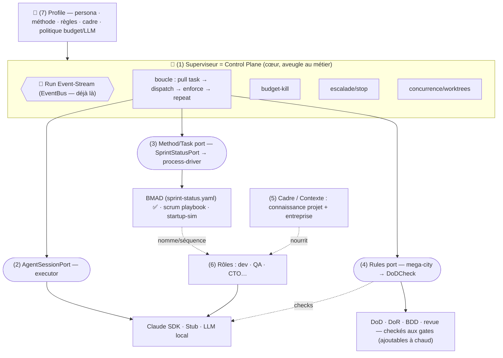

# ADR-022 — cop1 = control plane : ontologie & ports

Statut : 🚧 **WIP / Brouillon** (2026-06-28) — capture *vivante* du brainstorming produit.
**À challenger, pas une décision figée.** Ne rien implémenter sur cette seule base sans confirmation.
Voir aussi : ADR-020 (DoDCheck), ADR-021 (frontière mega-city, *Proposé*), fiche `features/0020`.

## Contexte

Issu d'une session `/product-brainstorming` (2026-06-28) + d'un scan concurrentiel de 10 outils
(CrewAI, AutoGen/AG2, MetaGPT, ChatDev, LangGraph, OpenHands, Devin, Aider, GPT-Pilot, AutoGPT)
+ d'une lecture du code cop1.

Question de fond : **qu'est-ce que cop1, exactement, et comment le découper (DDD) pour ne pas
recoder une méthode (scrum/BMAD) dans le cœur, ni devenir une simple surcouche de Claude Code ?**

Trois constats :
- **Positionnement** : cop1 n'est ni le dev, ni la méthode. C'est le **plan de contrôle de
  couche 2 — le "siège de supervision"** : budget, ordonnancement/nuit, routing LLM, frontière
  d'autonomie (continue/escalade/stop), concurrence. Le scan confirme que c'est le **quadrant vide**
  (les autres outils fusionnent méthode + règles + contrôle ; personne ne mène avec le control plane).
- **Réalité du code** : le control plane est **déjà ~85 % agnostique à l'agent**. La boucle, le
  budget, les gates DoD, les worktrees, l'EventBus ne connaissent rien à Claude. Claude n'est couplé
  que dans 2 fichiers, derrière le port `BMADSessionPort`. La **source des tâches** est `sprint-status.yaml`
  (artefact BMAD), mais **déjà derrière** `SprintStatusPort`.
- **Risque existentiel** : tant qu'un exécuteur **non-Claude** n'a pas tourné de bout en bout, la
  thèse « cop1 ≠ surcouche Claude » n'est pas prouvée (→ fiche 0020, enabler).

## Décision (provisoire) — l'ontologie à 7 briques

| # | Brique | Rôle | Aveugle au métier ? |
|---|--------|------|:---:|
| 1 | **Superviseur** (cop1 core) | cadence + contrôle (budget/escalade/concurrence) ; tire & dispatche les tâches | ✅ |
| 2 | **AgentSessionPort** (executor) | quel agent/LLM exécute une tâche (Claude SDK / Stub / LLM local) | ✅ |
| 3 | **Method/Task port** (process-driver) | d'où viennent les tâches, l'ordre, **quels rôles quand** | 🧠 le savant |
| 4 | **Rules / Governance** (mega-city) | contraintes **dures** checkées aux **gates/phases**, **ajoutables à chaud** | — |
| 5 | **Cadre / Contexte** | la **connaissance projet + entreprise** que les rôles utilisent | — |
| 6 | **Rôles / intervenants** | dev, QA, CTO… *exécutés* par (2), *séquencés* par (3), *nourris* par (5) | — |
| 7 | **Profile** | la **composition** d'un run : persona × méthode × règles × cadre × politique budget/LLM | — |

Principes :
- **Le superviseur (1) est aveugle au métier.** Il ne sait pas sur quoi porte le projet ; il tire
  des tâches du Method port et les dispatche à l'executor, en faisant respecter budget/escalade.
- **Trois ports, trois adaptateurs** : la méthode (BMAD/scrum/startup) = une impl de (3) ;
  l'agent (Claude/local) = une impl de (2) ; les règles (mega-city) = une impl de (4). **Jamais de
  code méthode-spécifique dans le cœur.**
- **Méthode ≠ règles ≠ cadre** : (3) = *comment le flux avance* ; (4) = *contraintes dures aux gates* ;
  (5) = *connaissance molle* dont les rôles se nourrissent. Un rôle CTO est *nommé par la méthode*,
  son savoir-entreprise vit dans le *cadre*.
- **Triangle des gates** : la **méthode (3)** dit *quand* il y a un gate ; les **règles (4)** disent
  *quoi* y vérifier ; le **superviseur (1)** *exécute* le check (= seam `DoDCheck`, ADR-020).

## Le loop cible

```
tant que methodPort.hasNext():          # (3) statique (yaml) OU dynamique (agent live)
    tâche    = methodPort.next()
    résultat = executor.run(tâche)       # (2) Claude | Stub | local
    enforce budget / gates(4) / escalade # (1) control plane, aveugle au métier
→ plus de tâche = fini
```

## Diagramme



## Réalité du code aujourd'hui (point de départ, pas cible)

- ✅ Génériques : `OrchestratorService` (loop), `RunBudget`/`BudgetGuard`, verify-gate, `DoDCheck`/iamthelaw, `WorktreePort`, `EventBus`/`TaggingEventBus`/SSE.
- ⚠️ Seam exécuteur : `BMADSessionPort` (`startSession`/`continueSession`), 2 impls (`AgentSdkSessionAdapter` SDK, `ClaudeResumeSessionAdapter` CLI) commutées par `COP1_BMAD_ADAPTER`. **À renommer `AgentSessionPort`** + ajouter une impl non-Claude (fiche 0020).
- ⚠️ Seam méthode : `SprintStatusPort` (`YamlSprintStatusAdapter`) lit `sprint-status.yaml` (BMAD). C'est le **Method/Task port en germe** ; aujourd'hui une seule impl (BMAD, statique).
- Couplage BMAD réel : ~63 fichiers prod, features `bmad-orchestration`/`bmad-reader`/`bmad-bridge`. **Localisé, derrière ports** — à généraliser, pas à recoder.

## Positionnement

- **Moat ≠ markdown** (table stakes). Moat = **frontière d'autonomie + fiabilité nocturne sous concurrence**.
- **vs Devin** (ship déjà scheduling + budget-kill, mais **verrouille méthode + agent**) : cop1 = **control plane open-source, self-hosted, BYO-agent**. Dire « method-pluggable, livré avec BMAD/scrum », jamais « agnostique » non prouvé.

## Questions ouvertes (WIP — à trancher avant d'implémenter)

1. **(4) Rules vs (5) Cadre** : deux briques distinctes, ou (5) se réduit-il à des « règles molles » dans (4) ? (hypothèse actuelle : distinctes — connaissance ≠ contrainte.)
2. **Method port : générique vs agent par méthode.** BMAD = doc + commandes OSS ; scrum = pas de source canonique → sans doute un **process-driver agent par méthode**. Tester sur 1 méthode (scrum) avant de généraliser ; si le markdown pur s'effondre → steps semi-structurés (YAML/typés).
3. **Source de tâches statique (yaml) vs dynamique (agent live)** derrière le même `methodPort.next()` : confirmer que les deux tiennent sous une seule interface.
4. **Nommage** : `BMADSessionPort → AgentSessionPort` (acté) ; « mega-city » comme nom de l'adapter de règles (à confirmer) ; nom de (5) Cadre.
5. **Recouvrement Profile** : le « Profile » mega-city (règles + agents + skills) est un **sous-ensemble** du Profile cop1 (7) — mega-city = *fournisseur de (4) [+ partie de (6)]*, pas le Profile global. À acter avec ADR-021.
6. **Règles dynamiques** : mécanique d'ajout de règles **en cours de projet** (qui, quand, où).
7. **Périmètre** : démarrer **dev-only** (positionnement) tout en gardant le cœur **domain-agnostique par construction** (ne pas fermer la généralisation, ne pas la construire).

## Conséquences / hors-scope

- Donne un **vocabulaire commun** (7 briques, 3 ports) pour découper sans recoder une méthode.
- **Hors-scope de cet ADR** : l'implémentation (fiche 0020 = 1er enabler) ; le choix générique-vs-agent du Method port ; le format exact des règles/cadre ; toute migration de nommage de masse.
- Reste **WIP** : à confirmer brique par brique, puis à promouvoir en *Proposé* quand le modèle sera stable.
